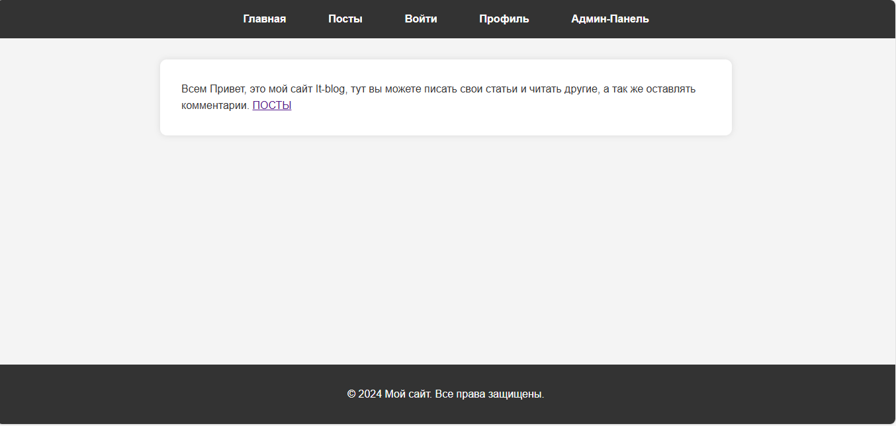
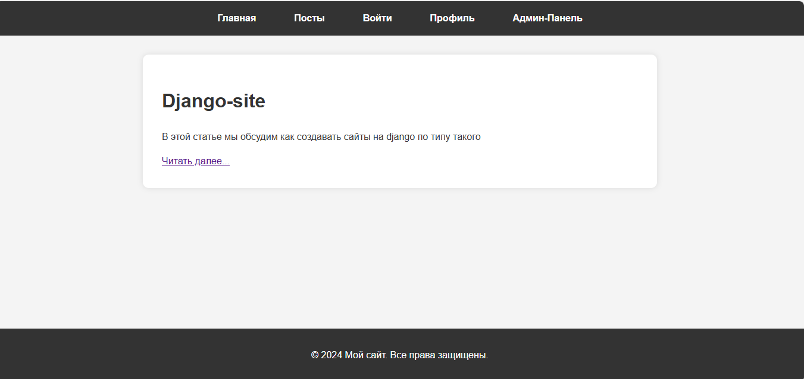

# IT-блог на Django

[](https://www.python.org/)
[](https://www.djangoproject.com/)
[](https://opensource.org/licenses/MIT)  <!-- Замените на вашу лицензию, если она другая -->

## Описание

Этот проект представляет собой IT-блог, разработанный на Django, позволяющий пользователям читать, публиковать собственные статьи и оставлять комментарии.

## Функциональность

*   Просмотр IT-статей.
*   Добавление новых статей (требуется авторизация).
*   Комментирование статей.
*   Подробный просмотр статьи на отдельной странице (detail_post.html).

## Установка

1.  После клонирования репозитория (через Git или скачиванием архива), активируйте виртуальное окружение Python.

2.  Установите необходимые библиотеки, выполнив команду:

    ```bash
    pip install -r req.txt
    ```

## Скриншоты

### Главная страница (index.html)



### Страница публикации (post.html)



### Страница авторизации (login.html)


### Страница просмотра статьи (detail_post.html)


## Автор
```
       __                           ___   ___                        ___     ___   ___                                
  .'|=|  |    .'|        .'|=|`.   |   | |   |      .'|=|`.     .'|=|_.'    |   | |   |   .'|=|`.     .'|   .'|=|`.   
.'  | |  |  .'  |      .'  | |  `. `.  |_|  .'    .'  | |  `. .'  |  ___    |   | |   | .'  | |  `. .'  | .'  | |  `. 
|   |=|.'   |   |      |   |=|   |   `.   .'      |   | |   | |   |=|_.'    |   | |   | |   | |   | |   | |   | |   | 
|   |       |   |  ___ |   | |   |    |   |       `.  | |  .' |   |         `.  | |  .' `.  | |  .' |   | |   | |  .' 
|___|       |___|=|_.' |___| |___|    |___|         `.|=|.'   |___|           `.|=|.'     `.|=|.'   |___| |___|=|.'   
                                                                                                                      ```
