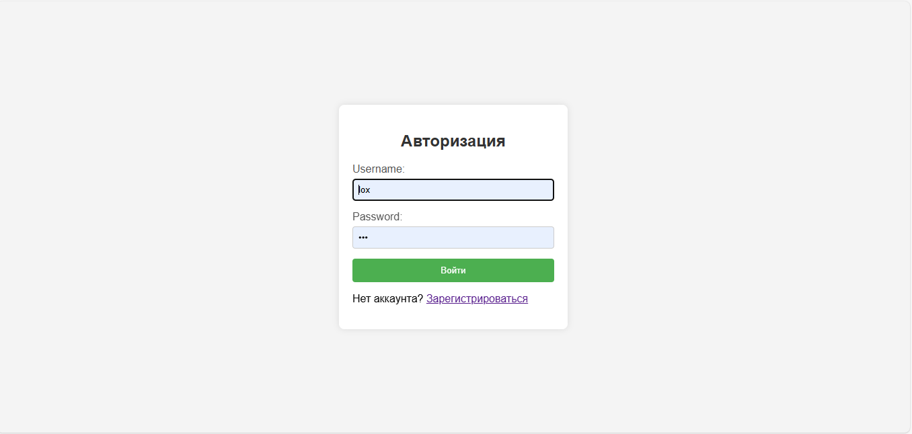

Всем привет!
Это мой сайт сделанный на Django
Его суть в том, что вы можете читать It-статьи, добавлять свои, и писать к ним комментарии

- если вы хотите скачать этот проект
после скачивание проекта через гит или архив, вам надо установить необходимые библиотеки, что бы это сделать активируйте виртуальное окружение python, после чего пропишите команду pip install -r req.txt

Скриншоты сайта ниже

index.html

post.html

login.html

detail_post.html

так же на detail_post отображаеться полная статья

